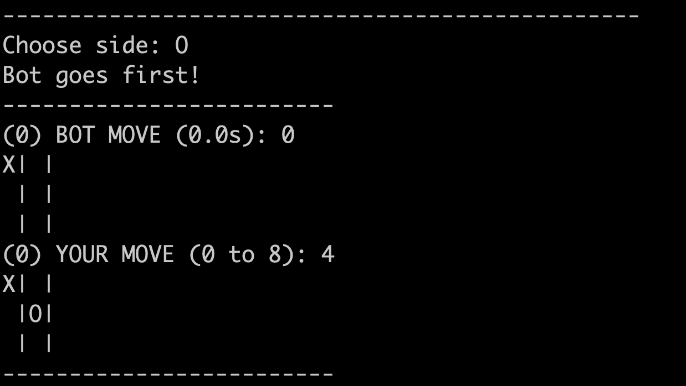
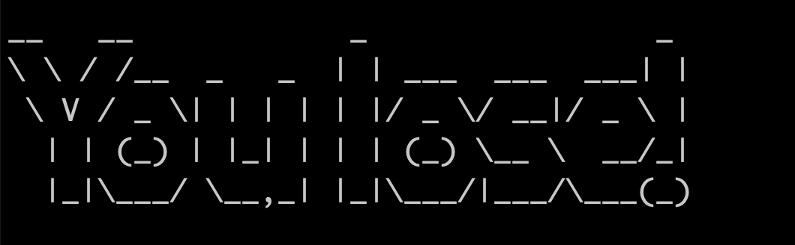

# tic_tac_toe_minimax

Minimax algorithm for tic tac toe. Just for fun! You never win this.

# Game start

# Moves

# Result

(the only one, believe me)

# How it works

[Inspiration](https://www.youtube.com/watch?v=l-hh51ncgDI) and [Wiki](https://en.wikipedia.org/wiki/Minimax)
